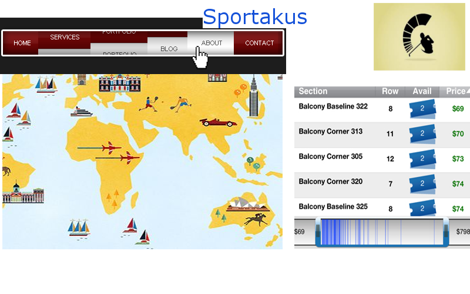

# sportakus
front-end project for DigitalCrafts

# Overview of Project
Our project will be sports aggragator that pulls: map of where current matches are held, options to buy tickets, historical data of past matches.

# Technologies, Frameworks, and Programming Languages used
We will utilize API's that provide us with geographical abilities, pull from mostly Sports Radar API.

# Contributors
Dave, Sandyha, Matthew

# Name of each team member and his/her individual contributions to the project
* Dave designed the mockup using GIMP

#Mockup Design

3 contributions your team would like for others to add to the project
*Dynamic data pulls from assorted API's

URL to live project

